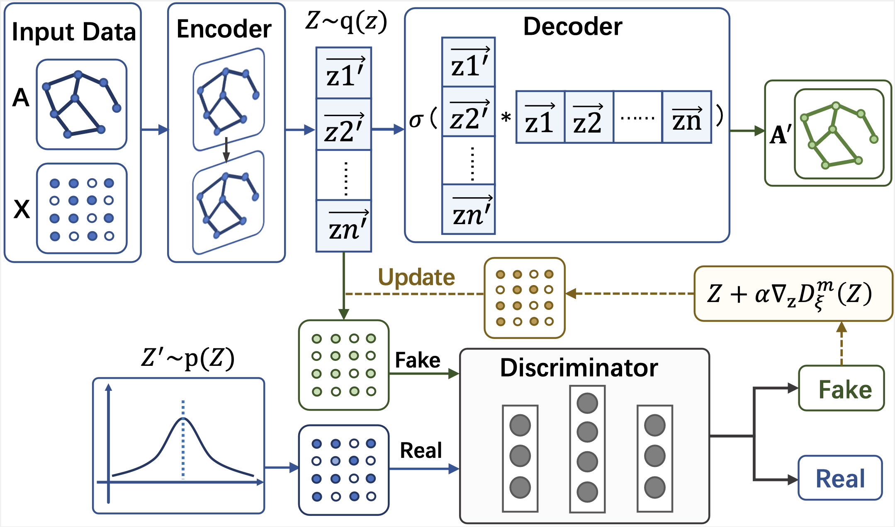

# Pessimistic Adversarially Regularized Learning for Graph Embedding (ADMA 2023)

## PGAE/PVGAE

PGAE is the code for our paper "Pessimistic Adversarially Regularized Learning for Graph Embedding", which is published in ADMA 2023. 



## Citation

```
@inproceedings{li2023pessimistic,
  title={Pessimistic Adversarially Regularized Learning for Graph Embedding},
  author={Li, Mengyao and Song, Yinghao and Yan, Long and Feng, Hanbin and Song, Yulun and Li, Yang and Wang, Gongju},
  booktitle={International Conference on Advanced Data Mining and Applications},
  pages={338--351},
  year={2023},
  organization={Springer}
}
```

## Data

In this example, we load citation network data (Cora, Citeseer or Pubmed). The original datasets can be found here: http://linqs.cs.umd.edu/projects/projects/lbc/ and here (in a different format): https://github.com/kimiyoung/planetoid

## Usage
- run "./pgae/run.py"
